# FinCrime Signals

**FinCrime Signals** is a synthetic data and workflow simulator inspired by real-world financial-crime controls. 

### 🎯 Project Goal

This project builds a realistic AML/KYC simulation environment using Python and synthetic data to reproduce AML tasks of reviewing alerts, escalating suspicious activity and case documentation.

To replicate casework, this project is divided into 

***

#### 🏦 Compliance Workflow

Each stage represents a layer of defense in a financial-crime prevention system.

| Stage | Description |
|:--|:--|
| 🧠 Know Your Customer | Verify customer identity and assign baseline risk before onboarding |
| 🔍 Enhanced Due Diligence | Conducted for higher-risk customers (based on nationality, industry, or transaction patterns). 
| 🔄 Ongoing Due Diligence | Ensures that customer activity remains consistent with their profile. |
| 💣 Anti-Money Laundering | Systemic detection of suspicious financial activity such as layering, structuring |
| 🧩 Investigation | Case review: Deep dive on chargebacks, account takeovers (ATO), phishing, and scams 
| 🧾 SAR/STR Reporting | Filing of Suspicious Activity Reports (SARs) or Suspicious Transaction Reports (STRs) to FIUs. |
| 🔁 Feedback Loop | Learning mechanism to improve system performance and reduce false positives. |

***

### 1. Data generation

To simulate a realistic the dataset and determine WISE's 160 operating countries and territories, OSINT on publicaly available pages was used.

##### 1.1: Establish a baseline

| Category                        | Description / Examples                                              |
|---------------------------------|----------------------------------------------------------------------|
| **UN Member States**           | 193 recognized member countries                                      |
| **Observer States**            | 2 (Vatican City, Palestine)                                         |
| **Dependent / Overseas Territories** | ~20–25 (e.g., Guernsey, Cayman Islands, Hong Kong, Bermuda, Gibraltar, etc.) |

|Total baseline ≈ **216 jurisdictions** |
|--------------|

##### 1.2: Exclude non-operational jurisdictions
 
|[Countries and regions we don't support](https://wise.com/help/articles/2978049/where-can-i-use-wise) — **21 excluded** |
|--------------|

##### 1.3: Apply Operational Filters

- [Wise Currencies You Can Hold](https://wise.com/help/articles/2897238/which-currencies-can-i-add-keep-and-receive-in-my-wise-account)
- [Wise Transfer Guides](https://wise.com/help/section/transfer-guides)

| Exclusion Criteria | Example Countries |
|-----------------------|-------------------|
| No local clearing or correspondent network | Nauru, Tuvalu, Micronesia, Marshall Islands |
| FX or capital-control restrictions | Bhutan, Nepal, Turkmenistan |
| Political or corruption risk (no licensing path) | Equatorial Guinea, Eritrea, Tajikistan |
| Partial presence but no retail corridor | Algeria, Mongolia (no local currency support) |

|Approximate reduction: **– 35 jurisdictions**|
|--------------|

##### 1.4: Include Territories via Parent Licenses

| Country / Region | Territories Included |
|-------------------------|----------------------|
| 🇬🇧 **United Kingdom** | Guernsey, Jersey, Isle of Man, Gibraltar, Cayman Islands, Bermuda, British Virgin Islands |
| 🇫🇷 **France** | Guadeloupe, Martinique, Réunion, Mayotte, Saint Barthélemy |
| 🇺🇸 **United States** | Guam, Puerto Rico, American Samoa, Northern Mariana Islands |
| 🇳🇱 **Netherlands** | Aruba, Curaçao, Sint Maarten |
| 🇩🇰 **Denmark** | Greenland, Faroe Islands |
| 🇳🇿 **New Zealand** | Cook Islands, Niue, Tokelau |
| 🇦🇺 **Australia** | Norfolk Island |

These territories inherit their parent country’s financial-regulatory environment, allowing Wise to legally extend coverage.

##### 1.4 Deduced 160 countries and territories ✅

| 🌍 Region | 🏳️ Countries & Territories |
|------------|----------------------------|
| **🇪🇺 Europe (45)** | Andorra, Austria, Belgium, Bosnia and Herzegovina, Bulgaria, Croatia, Cyprus, Czech Republic, Denmark, Estonia, Finland, France, Germany, Greece, Hungary, Iceland, Ireland, Italy, Kosovo, Latvia, Liechtenstein, Lithuania, Luxembourg, Malta, Moldova, Monaco, Montenegro, Netherlands, North Macedonia, Norway, Poland, Portugal, Romania, San Marino, Serbia, Slovakia, Slovenia, Spain, Sweden, Switzerland, Ukraine, United Kingdom, Vatican City, Gibraltar, Channel Islands *(Guernsey, Jersey, Isle of Man)* |
| **🌎 Americas (35)** | United States, Canada, Mexico, Argentina, Brazil, Chile, Colombia, Peru, Uruguay, Paraguay, Ecuador, Bolivia, Panama, Costa Rica, Guatemala, Honduras, Dominican Republic, Jamaica, Barbados, Bermuda, Cayman Islands, Bahamas, Puerto Rico, Turks and Caicos Islands, Curaçao, Aruba, Sint Maarten, British Virgin Islands, Suriname, Guyana |
| **🌍 Africa (25)** | Algeria, Botswana, Cameroon, Côte d’Ivoire, Egypt, Ethiopia, Ghana, Kenya, Lesotho, Madagascar, Malawi, Mauritius, Morocco, Mozambique, Namibia, Nigeria, Rwanda, Senegal, Seychelles, South Africa, Tanzania, Tunisia, Uganda, Zambia, Zimbabwe |
| **🌏 "Asia + Middle East" (45)** | Armenia, Azerbaijan, Bahrain, Bangladesh, Brunei, Cambodia, China, Georgia, Hong Kong, India, Indonesia, Israel, Japan, Jordan, Kazakhstan, Kuwait, Kyrgyzstan, Laos, Lebanon, Macau, Malaysia, Maldives, Mongolia, Nepal, Oman, Pakistan, Philippines, Qatar, Saudi Arabia, Singapore, South Korea, Sri Lanka, Taiwan, Tajikistan, Thailand, Timor-Leste, Turkey, United Arab Emirates, Uzbekistan, Vietnam |
| **🌊 Oceania (21)** | Australia, New Zealand, Fiji, Papua New Guinea, Samoa, Solomon Islands, Tonga, Vanuatu, Palau, Micronesia, Marshall Islands, Nauru, New Caledonia, French Polynesia, Cook Islands, Guam, Northern Mariana Islands, American Samoa, Tokelau, Niue, Norfolk Island |

Assuming the customer has passed the 🧠 KYC,  🔍 EDD and 🔄 ODD process:

``` mermaid
flowchart LR

A([⚠️ EDD Trigger]) --> B([📄 Information Gathering])
B --> C([🔍 Advanced Screening])
C --> D([📊 Risk Re-Assessment])
D --> E([✅ Outcome])

%% Styling
classDef edd_trigger fill:#ffd6d6,stroke:#d62828,color:#000;
classDef edd_info fill:#f5e0b7,stroke:#e76f51,color:#000;
classDef edd_screening fill:#ffeabf,stroke:#ffb703,color:#000;
classDef edd_reassess fill:#e0bbff,stroke:#6a4c93,color:#000;
classDef edd_outcome fill:#d2f4ff,stroke:#0077b6,color:#000;

class A edd_trigger;
class B edd_info;
class C edd_screening;
class D edd_reassess;
class E edd_outcome;
```

``` mermaid
flowchart LR

A([📡 Continuous Monitoring]) --> B([🚨 Trigger Review])
B --> C([♻️ Periodic KYC Refresh])
C --> D([🧠 Feedback Loop])

%% Styling
classDef odd_monitor fill:#d2f4ff,stroke:#0077b6,color:#000;
classDef odd_trigger fill:#ffeabf,stroke:#ffb703,color:#000;
classDef odd_refresh fill:#e9f5db,stroke:#52b788,color:#000;
classDef odd_feedback fill:#f5e0b7,stroke:#e76f51,color:#000;

class A odd_monitor;
class B odd_trigger;
class C odd_refresh;
class D odd_feedback;
```

The tables below shows a realistic schema reflecting a post-onboarding customer record with AML/CTF-relevant fields:

#### Core Dataset: KYC + General
| Field Name             | Description                                                                 |
|--------------------------|-----------------------------------------------------------------------------|
| `customer_id`            | Unique internal ID assigned during onboarding                              |
| `name`                   | Full legal name of the customer                                            |
| `dob`                    | Date of birth                                                              |
| `nationality`            | Declared nationality                                                       |
| `residency_country`      | Country of residence                                                       |
| `jurisdiction_risk`      | Risk rating of customer's country (e.g., Low, Medium, High)                 |
| `account_type`           | Type of account (e.g., Personal, Business, Joint)                          |
| `occupation`             | Customer’s declared profession or economic role                            |
| `source_of_funds`        | Origin of customer’s funds (e.g., Salary, Inheritance, Business Revenue)   |
| `pep_flag`               | Boolean flag indicating if the customer is a Politically Exposed Person    |
| `screening_result`       | Outcome of sanctions / PEP / adverse media screening                       |
| `device_count`           | Number of unique devices used during sign-up / login                       |
| `join_date`              | Date when the account was opened                                           |
| `kyc_status`             | Status of onboarding (e.g., Verified, Pending, Rejected)                   |
| `risk_score`             | Overall risk level (Low, Medium, High) based on scoring logic              |
| `onboarding_decision`    | Final onboarding decision (Approved, Rejected, Manual Review)              |

##### EDD Dataset: - Triggered Review
| Field Name                 | Description                                                                 |
|-----------------------------|-----------------------------------------------------------------------------|
| `edd_trigger_reason`        | Why EDD was initiated (e.g., High-risk country, PEP, unusual transaction)  |
| `edd_information_collected` | Additional documents or data gathered (e.g., Source of Funds, UBO details) |
| `edd_screening_result`      | Outcome of advanced screening (Cleared, Escalated, Further Review)         |
| `edd_risk_reassessment`     | Updated risk level after enhanced review                                   |
| `edd_outcome`               | Final EDD result (e.g., Account retained, Restricted, SAR filed)           |
| `edd_completed_date`        | Date when the EDD process was concluded                                    |
##### ODD Dataset: - Continous Monitoring
| Field Name               | Description                                                                 |
|---------------------------|-----------------------------------------------------------------------------|
| `last_review_date`        | Date of last review or transaction monitoring activity                      |
| `monitoring_status`       | Current ODD status (Normal, Under Review, Escalated)                        |
| `odd_trigger_count`       | Number of alerts or triggers generated for this customer                    |
| `odd_last_trigger_type`   | Most recent trigger (e.g., unusual transaction, threshold breach)            |
| `kyc_refresh_due`         | Date of next periodic KYC update or review                                  |
| `feedback_flag`           | Analyst/system flag for false positives or alert refinement suggestions     |
| `odd_review_outcome`      | Result of the last ODD review (Cleared, Escalated, Reported)                |
| `odd_updated_risk_level`  | Risk rating after ODD reassessment                                          |

For the purposes of this project focused on simulating **AML** investigations, only customers.csv and transactions.csv will be used. The **customers.csv** file contains synthetic customer profiles with sufficient attributes to support:

- Risk-based alert prioritisation
- KYC/EDD/ODD logic simulation
- Transaction behavior analysis

Each field contributes to customer risk assessment and case investigation context.

### 📄 `customers.csv` Schema

| Field Name         | Description                                                                 |
|--------------------|-----------------------------------------------------------------------------|
| `customer_id`      | Unique customer ID used for joining with transactions                      |
| `name`             | Full name of the customer                                                   |
| `residence`        | Customer's declared country of residence                                    |
| `jurisdiction_risk`| Country risk level (Low, Medium, High) based on FATF or internal mapping    |
| `account_type`     | Type of account (e.g., Personal, Business, Joint)                          |
| `occupation`       | Profession or declared economic role (e.g., Student, Importer, Engineer)    |
| `source_of_funds`  | Source of funds (e.g., Salary, Investment Income, Inheritance)              |
| `pep_flag`         | Boolean flag indicating PEP status (True/False)                             |
| `id_verified`      | Boolean field indicating if identity documents have been verified           |
| `device_count`     | Number of unique devices used by the customer (fraud/behavioral signal)     |
| `signup_date`      | Date the customer was onboarded                                             |
| `risk_level`       | Final KYC risk rating (Low, Medium, High), used to trigger EDD if needed    |

***

### 2. Customer Risk Rating

To determine the baseline financial-crime risk level of each customer at onboarding by evaluating multiple risk factors.

#### Methodology

The risk score is calculated by assigning weighted points to various fields in the `customers.csv` record. The total score is then mapped to a final `risk_level` (Low, Medium, High).

#### 🗺 Jurisdiction Risk

| Risk Level | Mapping Criteria |
|------------|------------------|
| **Low**    | FATF-compliant, low corruption, stable banking systems (e.g., EE, DE, SE, UK, NZ, CA) |
| **Medium** | Moderate AML exposure, partially regulated, higher informal economy (e.g., IN, BR, KE, PH, VN) |
| **High**   | Sanctions exposure, PEP-heavy, high predicate crime risk (e.g., NG, PK, CN, UZ, ID, MA) |

---

#### 🧾 Account Type Risk

| Account Type       | Risk Points | Rationale |
|--------------------|-------------|-----------|
| Personal           | 0           | Standard consumer risk |
| Joint              | +1          | More complex ownership |
| Business           | +2          | Higher transaction volumes, possible shell entities |

---

#### 💼 Occupation Risk

| Occupation Category        | Risk Points | Examples / Notes |
|----------------------------|-------------|------------------|
| Low Risk                   | 0           | Teacher, Engineer, Doctor, Civil Servant |
| Medium Risk                | +1          | Import/Export, Real Estate Agent, Cryptocurrency Trader |
| High Risk / Cash Intensive| +2          | Laundry Operator, Used Car Dealer|

---

#### 💸 Source of Funds Risk

| Source of Funds     | Risk Points | Rationale |
|---------------------|-------------|-----------|
| Salary / Employment | 0           | Verifiable and stable |
| Inheritance / Savings| +1         | Harder to verify; non-regular |
| Business Revenue     | +1         | Can involve shell entities |
| Crypto / Cash        | +2         | Anonymous, layered, or high-risk sectors |

---

### 🔢 Risk Score Matrix

| Factor              | Values / Range                             | Points |
|---------------------|--------------------------------------------|--------|
| Jurisdiction Risk   | Low / Medium / High                        | 0 / +1 / +2 |
| Account Type        | Personal / Joint / Business                | 0 / +1 / +2 |
| Occupation Risk     | Low / Medium / High                        | 0 / +1 / +2 |
| Source of Funds     | Salary / Inheritance / Business / Crypto   | 0 / +1 / +1 / +2 |
| PEP Flag            | False / True                               | 0 / +2 |
| ID Verified         | True / False                               | 0 / +1 |
| Device Count        | 1 / 2 / ≥3                                 | 0 / +1 / +2 |

> Each customer is scored based on the above table. The total score determines the final KYC risk rating.

---

