# 🌍 FinCrime Signals

**FinCrime Signals** is a synthetic data and workflow simulator inspired by real-world financial-crime controls. It models **cross-border money movement**, **KYC/EDD pipelines**, and **jurisdictional risk logic** across 160 supported countries and territories.

## 🧠 Overview

This project builds a realistic AML/KYC simulation environment using Python and synthetic data to reproduce Wise-like compliance behaviors:

The focus of this project will be on the AML investigator workflow hence the customer onboarding and kyc risk scoring will be assumed as fields in 

- Customer onboarding and KYC risk scoring  
- Enhanced Due Diligence (EDD) for high-risk profile
- Transaction monitoring and sanctions screening  
- Country and currency-based regulatory logic  
- Data pipelines that generate realistic customer & transaction CSVs

### Compliance Workflow (simplified)

``` mermaid

flowchart LR

A([🧠 KYC]) -->|High Risk| B([🔍 EDD])
A --> C([✅ Onboarded])
B --> C
C --> D([🔄 ODD])
D --> E([💣 AML / Fraud Monitoring])
E --> F([🧩 Investigation])
F --> G([🧾 SAR / STR Reporting])
G --> H([🔁 Feedback Loop])
H --> A

%% Optional styling for clarity
classDef kyc fill:#d2f4ff,stroke:#0077b6,color:#000;
classDef edd fill:#ffeabf,stroke:#ffb703,color:#000;
classDef onboard fill:#e9f5db,stroke:#74c69d,color:#000;
classDef odd fill:#d3f9d8,stroke:#52b788,color:#000;
classDef aml fill:#ffd6d6,stroke:#e63946,color:#000;
classDef inv fill:#e0bbff,stroke:#6a4c93,color:#000;
classDef sar fill:#fff3bf,stroke:#e9c46a,color:#000;
classDef fb fill:#caf0f8,stroke:#0077b6,color:#000;

class A kyc;
class B edd;
class C onboard;
class D odd;
class E aml;
class F inv;
class G sar;
class H fb;
```

Each block in the flowchart represents a critical defense layer within a financial crime prevention system. Together, they form a continuous loop of risk identification → mitigation → reporting → learning.

| Stage | Description | Key Investigator Understanding |
|:--|:--|:--|
| 🧠 KYC (Know Your Customer) | Establishes the customer’s identity, source of funds, and intended account use. | A robust KYC profile defines the “expected behavior baseline.” Investigators rely on this to identify when a customer’s actual transactions deviate from expectations. |
| 🔍 EDD (Enhanced Due Diligence) | Conducted for higher-risk customers (based on nationality, industry, or transaction patterns). | Involves verifying documentation, analyzing ownership structure, and checking for adverse media. This prevents onboarding entities that could expose the institution to sanctions or reputational risk. |
| 🔄 ODD (Ongoing Due Diligence) | Ensures that customer activity remains consistent with their profile. | Investigators use transaction monitoring tools to detect anomalies (e.g., sudden large inflows, layering activity). Triggers are reviewed, and KYC profiles are refreshed if risk exposure increases. |
| 💣 AML Monitoring (Anti-Money Laundering) | Systemic detection of suspicious financial activity such as layering, structuring, or terrorist financing. | Alerts are generated based on pre-defined typologies and behavioral rules (e.g., velocity checks, cross-border transfers, or cash-intensive flows). Investigators assess whether patterns are suspicious or explainable. |
| 🧩 Investigation | Deep-dive case review where analysts gather supporting documentation and evaluate intent. | Analysts apply both quantitative (transaction data) and qualitative (customer communication, behavior) analysis to form a judgment. |
| 🧾 SAR/STR Reporting | Filing of Suspicious Activity Reports (SARs) or Suspicious Transaction Reports (STRs) to FIUs. | Accuracy and clarity in narrative writing are critical. Reports must state facts, reasoning, and conclusions without bias. |
| 🔁 Feedback Loop | Learning mechanism to improve system performance and reduce false positives. | Investigator insights feed back into rule tuning, product risk design, and training datasets for model-based monitoring. |

### 🧠 Know Your Customer

Verify customer identity and assess baseline risk before onboarding

```mermaid

flowchart LR

A([👋 Customer Onboarding]) --> B([🪪 Identity Verification])
B --> C([🚦 Screening])
C --> D([🧮 Customer Risk Scoring])
D --> E([✅ Decision])

%% --- Optional styling for consistency ---
classDef onboarding fill:#d2f4ff,stroke:#0077b6,color:#000;
classDef idv fill:#e9f5db,stroke:#52b788,color:#000;
classDef screening fill:#ffeabf,stroke:#ffb703,color:#000;
classDef scoring fill:#e0bbff,stroke:#6a4c93,color:#000;
classDef decision fill:#fff3bf,stroke:#e9c46a,color:#000;

class A onboarding;
class B idv;
class C screening;
class D scoring;
class E decision;
```

### 🔍 Enhanced Due Diligence

```mermaid
flowchart LR

A([⚠️ Trigger]) --> B([📂 Information Gathering])
B --> C([🔎 Advanced Screening])
C --> D([📊 Risk Re-Assessment])
D --> E([🧾 Outcome])

%% --- Optional styling for clarity and consistency ---
classDef trigger fill:#ffd6d6,stroke:#e63946,color:#000;
classDef info fill:#d2f4ff,stroke:#0077b6,color:#000;
classDef screening fill:#ffeabf,stroke:#ffb703,color:#000;
classDef reassess fill:#e0bbff,stroke:#6a4c93,color:#000;
classDef outcome fill:#e9f5db,stroke:#52b788,color:#000;

class A trigger;
class B info;
class C screening;
class D reassess;
class E outcome;
```

### 🔄 Ongoing Due Diligence

```mermaid
flowchart LR

A([🔄 Continuous Monitoring]) --> B([⚠️ Trigger Reviews])
B --> C([📅 Periodic KYC Refresh])
C --> D([🔁 Feedback Loop])

%% --- Optional styling for consistency ---
classDef monitor fill:#d2f4ff,stroke:#0077b6,color:#000;
classDef trigger fill:#ffeabf,stroke:#ffb703,color:#000;
classDef refresh fill:#e0bbff,stroke:#6a4c93,color:#000;
classDef feedback fill:#e9f5db,stroke:#52b788,color:#000;

class A monitor;
class B trigger;
class C refresh;
class D feedback;
```

### 💣 Anti Money Laundering

```mermaid
flowchart LR
A([💸 Transaction Monitoring]) --> B([🚨 Alert Generation])
B --> C([🧠 Alert Review & Analysis])
C --> D([📂 Case Management])
D --> E([🧾 SAR / STR Filing])
E --> F([🔁 Feedback to Product & Monitoring Rules])

classDef monitor fill:#ffd6d6,stroke:#e63946,color:#000;
classDef alert fill:#ffeabf,stroke:#ffb703,color:#000;
classDef review fill:#e0bbff,stroke:#6a4c93,color:#000;
classDef case fill:#d2f4ff,stroke:#0077b6,color:#000;
classDef sar fill:#fff3bf,stroke:#e9c46a,color:#000;
classDef feedback fill:#e9f5db,stroke:#52b788,color:#000;

class A monitor;
class B alert;
class C review;
class D case;
class E sar;
class F feedback;
```

### 🧩 Fraud & Risk Investigation

```mermaid
flowchart LR

A([🔎 Incident Detection]) --> B([📊 Case Analysis])
B --> C([🧩 Typology Mapping])
C --> D([📈 Risk Scoring & Correlation])
D --> E([🧠 Product & Policy Feedback])

classDef detect fill:#ffd6d6,stroke:#e63946,color:#000;
classDef analysis fill:#e0bbff,stroke:#6a4c93,color:#000;
classDef mapping fill:#ffeabf,stroke:#ffb703,color:#000;
classDef scoring fill:#d2f4ff,stroke:#0077b6,color:#000;
classDef feedback fill:#e9f5db,stroke:#52b788,color:#000;

class A detect;
class B analysis;
class C mapping;
class D scoring;
class E feedback;

```

