# FinCrime Signals

**[FinCrime Signals](https://jasonfong-aml.streamlit.app)** is a synthetic data and workflow simulator inspired by real-world financial-crime controls. 

### 🎯 Project Goal

This project builds a realistic AML/KYC simulation environment using Python and synthetic data to reproduce AML tasks of reviewing alerts, escalating suspicious activity and case documentation.

To replicate casework, this project is divided into:
-  **1. Data Fields**
-  **2. Customer Risk Rating**
-  **3. Transactions**
-  **4. Limitations & Future Enchancements**
-  **5. AML Analyst Flow**

***

#### 🏦 Compliance Workflow

``` mermaid

flowchart LR

A([🧠 KYC]) -->|High Risk| B([🔍 EDD])
A --> C([✅ Onboarded])
B --> C
C --> D([🔄 ODD])
D --> E([💣 AML / Fraud Monitoring])
E --> F([🧩 Investigation])
F --> G([🧾 SAR / STR Reporting])
G --> H([🔁 Feedback Loop])
H --> A

%% Optional styling for clarity
classDef kyc fill:#d2f4ff,stroke:#0077b6,color:#000;
classDef edd fill:#ffeabf,stroke:#ffb703,color:#000;
classDef onboard fill:#e9f5db,stroke:#74c69d,color:#000;
classDef odd fill:#d3f9d8,stroke:#52b788,color:#000;
classDef aml fill:#ffd6d6,stroke:#e63946,color:#000;
classDef inv fill:#e0bbff,stroke:#6a4c93,color:#000;
classDef sar fill:#fff3bf,stroke:#e9c46a,color:#000;
classDef fb fill:#caf0f8,stroke:#0077b6,color:#000;

class A kyc;
class B edd;
class C onboard;
class D odd;
class E aml;
class F inv;
class G sar;
class H fb;
```

Each stage represents a layer of defense in a financial-crime prevention system.

| Stage | Description |
|:--|:--|
| 🧠 Know Your Customer | Verify customer identity and assign baseline risk before onboarding |
| 🔍 Enhanced Due Diligence | Conducted for higher-risk customers (based on nationality, industry, or transaction patterns). 
| 🔄 Ongoing Due Diligence | Ensures that customer activity remains consistent with their profile. |
| 💣 Anti-Money Laundering | Systemic detection of suspicious financial activity such as layering, structuring |
| 🧩 Investigation | Case review: Deep dive on chargebacks, account takeovers (ATO), phishing, and scams 
| 🧾 SAR/STR Reporting | Filing of Suspicious Activity Reports (SARs) or Suspicious Transaction Reports (STRs) to FIUs. |
| 🔁 Feedback Loop | Learning mechanism to improve system performance and reduce false positives. |

***

### 1. Data generation

To simulate a realistic the dataset and determine WISE's 160 operating countries and territories, OSINT on publicaly available pages was used.

##### 1.1: Establish a baseline

| Category                        | Description / Examples                                              |
|---------------------------------|----------------------------------------------------------------------|
| **UN Member States**           | 193 recognized member countries                                      |
| **Observer States**            | 2 (Vatican City, Palestine)                                         |
| **Dependent / Overseas Territories** | ~20–25 (e.g., Guernsey, Cayman Islands, Hong Kong, Bermuda, Gibraltar, etc.) |

>Total baseline ≈ **216 jurisdictions** 

---

##### 1.2: Exclude non-operational jurisdictions
 
>[Countries and regions we don't support](https://wise.com/help/articles/2978049/where-can-i-use-wise) — **21 excluded** 

---

##### 1.3: Apply Operational Filters

- [Wise Currencies You Can Hold](https://wise.com/help/articles/2897238/which-currencies-can-i-add-keep-and-receive-in-my-wise-account)
- [Wise Transfer Guides](https://wise.com/help/section/transfer-guides)

| Exclusion Criteria | Example Countries |
|-----------------------|-------------------|
| No local clearing or correspondent network | Nauru, Tuvalu, Micronesia, Marshall Islands |
| FX or capital-control restrictions | Bhutan, Nepal, Turkmenistan |
| Political or corruption risk (no licensing path) | Equatorial Guinea, Eritrea, Tajikistan |
| Partial presence but no retail corridor | Algeria, Mongolia (no local currency support) |

>Approximate reduction: **– 35 jurisdictions**

---

##### 1.4: Include Territories via Parent Licenses

| Country / Region | Territories Included |
|-------------------------|----------------------|
| 🇬🇧 **United Kingdom** | Guernsey, Jersey, Isle of Man, Gibraltar, Cayman Islands, Bermuda, British Virgin Islands |
| 🇫🇷 **France** | Guadeloupe, Martinique, Réunion, Mayotte, Saint Barthélemy |
| 🇺🇸 **United States** | Guam, Puerto Rico, American Samoa, Northern Mariana Islands |
| 🇳🇱 **Netherlands** | Aruba, Curaçao, Sint Maarten |
| 🇩🇰 **Denmark** | Greenland, Faroe Islands |
| 🇳🇿 **New Zealand** | Cook Islands, Niue, Tokelau |
| 🇦🇺 **Australia** | Norfolk Island |

>These territories inherit their parent country’s financial-regulatory environment, allowing Wise to legally extend coverage.

---

##### 1.4 Deduced 160 countries and territories ✅

| 🌍 Region | 🏳️ Countries & Territories |
|------------|----------------------------|
| **🇪🇺 Europe (45)** | Andorra, Austria, Belgium, Bosnia and Herzegovina, Bulgaria, Croatia, Cyprus, Czech Republic, Denmark, Estonia, Finland, France, Germany, Greece, Hungary, Iceland, Ireland, Italy, Kosovo, Latvia, Liechtenstein, Lithuania, Luxembourg, Malta, Moldova, Monaco, Montenegro, Netherlands, North Macedonia, Norway, Poland, Portugal, Romania, San Marino, Serbia, Slovakia, Slovenia, Spain, Sweden, Switzerland, Ukraine, United Kingdom, Vatican City, Gibraltar, Channel Islands *(Guernsey, Jersey, Isle of Man)* |
| **🌎 Americas (35)** | United States, Canada, Mexico, Argentina, Brazil, Chile, Colombia, Peru, Uruguay, Paraguay, Ecuador, Bolivia, Panama, Costa Rica, Guatemala, Honduras, Dominican Republic, Jamaica, Barbados, Bermuda, Cayman Islands, Bahamas, Puerto Rico, Turks and Caicos Islands, Curaçao, Aruba, Sint Maarten, British Virgin Islands, Suriname, Guyana |
| **🌍 Africa (25)** | Algeria, Botswana, Cameroon, Côte d’Ivoire, Egypt, Ethiopia, Ghana, Kenya, Lesotho, Madagascar, Malawi, Mauritius, Morocco, Mozambique, Namibia, Nigeria, Rwanda, Senegal, Seychelles, South Africa, Tanzania, Tunisia, Uganda, Zambia, Zimbabwe |
| **🌏 "Asia + Middle East" (45)** | Armenia, Azerbaijan, Bahrain, Bangladesh, Brunei, Cambodia, China, Georgia, Hong Kong, India, Indonesia, Israel, Japan, Jordan, Kazakhstan, Kuwait, Kyrgyzstan, Laos, Lebanon, Macau, Malaysia, Maldives, Mongolia, Nepal, Oman, Pakistan, Philippines, Qatar, Saudi Arabia, Singapore, South Korea, Sri Lanka, Taiwan, Tajikistan, Thailand, Timor-Leste, Turkey, United Arab Emirates, Uzbekistan, Vietnam |
| **🌊 Oceania (21)** | Australia, New Zealand, Fiji, Papua New Guinea, Samoa, Solomon Islands, Tonga, Vanuatu, Palau, Micronesia, Marshall Islands, Nauru, New Caledonia, French Polynesia, Cook Islands, Guam, Northern Mariana Islands, American Samoa, Tokelau, Niue, Norfolk Island |
---

##### 1.5 Dataset Fields in Compliance Workflow
Assuming the customer has passed the 🧠 KYC,  🔍 EDD and 🔄 ODD process:

``` mermaid
flowchart LR

A([📡 Continuous Monitoring]) --> B([🚨 Trigger Review])
B --> C([♻️ Periodic KYC Refresh])
C --> D([🧠 Feedback Loop])

%% Styling
classDef odd_monitor fill:#d2f4ff,stroke:#0077b6,color:#000;
classDef odd_trigger fill:#ffeabf,stroke:#ffb703,color:#000;
classDef odd_refresh fill:#e9f5db,stroke:#52b788,color:#000;
classDef odd_feedback fill:#f5e0b7,stroke:#e76f51,color:#000;

class A odd_monitor;
class B odd_trigger;
class C odd_refresh;
class D odd_feedback;
```

The tables below reflect a realistic schema of data with AML/CTF-relevant fields post onboarding:

##### Core Dataset: KYC + General
| Field Name             | Description                                                                 |
|--------------------------|-----------------------------------------------------------------------------|
| `customer_id`            | Unique internal ID assigned during onboarding                              |
| `name`                   | Full legal name of the customer                                            |
| `dob`                    | Date of birth                                                              |
| `nationality`            | Declared nationality                                                       |
| `residency_country`      | Country of residence                                                       |
| `jurisdiction_risk`      | Risk rating of customer's country (e.g., Low, Medium, High)                 |
| `account_type`           | Type of account (Personal, Business)                          |
| `occupation`             | Customer’s declared profession or economic role                            |
| `source_of_funds`        | Origin of customer’s funds (e.g., Salary, Inheritance, Business Revenue)   |
| `pep_flag`               | Boolean flag indicating if the customer is a Politically Exposed Person    |
| `screening_result`       | Outcome of sanctions / PEP / adverse media screening                       |
| `device_count`           | Number of unique devices used during sign-up / login                       |
| `join_date`              | Date when the account was opened                                           |
| `kyc_status`             | Status of onboarding (e.g., Verified, Pending, Rejected)                   |
| `risk_score`             | Overall risk level (Low, Medium, High) based on scoring logic              |
| `onboarding_decision`    | Final onboarding decision (Approved, Rejected, Manual Review)              |

###### EDD Dataset: - Triggered Review
| Field Name                 | Description                                                                 |
|-----------------------------|-----------------------------------------------------------------------------|
| `edd_trigger_reason`        | Why EDD was initiated (e.g., High-risk country, PEP, unusual transaction)  |
| `edd_information_collected` | Additional documents or data gathered (e.g., Source of Funds, UBO details) |
| `edd_screening_result`      | Outcome of advanced screening (Cleared, Escalated, Further Review)         |
| `edd_risk_reassessment`     | Updated risk level after enhanced review                                   |
| `edd_outcome`               | Final EDD result (e.g., Account retained, Restricted, SAR filed)           |
| `edd_completed_date`        | Date when the EDD process was concluded                                    |
###### ODD Dataset: - Continous Monitoring
| Field Name               | Description                                                                 |
|---------------------------|-----------------------------------------------------------------------------|
| `last_review_date`        | Date of last review or transaction monitoring activity                      |
| `monitoring_status`       | Current ODD status (Normal, Under Review, Escalated)                        |
| `odd_trigger_count`       | Number of alerts or triggers generated for this customer                    |
| `odd_last_trigger_type`   | Most recent trigger (e.g., unusual transaction, threshold breach)            |
| `kyc_refresh_due`         | Date of next periodic KYC update or review                                  |
| `feedback_flag`           | Analyst/system flag for false positives or alert refinement suggestions     |
| `odd_review_outcome`      | Result of the last ODD review (Cleared, Escalated, Reported)                |
| `odd_updated_risk_level`  | Risk rating after ODD reassessment                                          |

For the purposes of this project, only customers.csv and transactions.csv will be used to simulate the workflow of  **AML** investigations.

The **customers.csv** file will therefore contain synthetic customer profiles with sufficient attributes to support:

- Risk-based alert prioritisation
- KYC/EDD/ODD logic simulation
- Transaction behavior analysis

Each **field** will contribute to the customer **risk assessment** and context for **case investigation**.

---

##### 1.6 📄 `customers.csv` Schema

| Field Name         | Description                                                                 |
|--------------------|-----------------------------------------------------------------------------|
| `customer_id`      | Unique customer ID used for joining with transactions                      |
| `name`             | Full name of the customer                                                   |
| `residence`        | Customer's declared country of residence                                    |
| `jurisdiction_risk`| Country risk level (Low, Medium, High) based on FATF or internal mapping    |
| `account_type`     | Type of account (e.g., Personal, Business, Joint)                          |
| `occupation`       | Profession or declared economic role (e.g., Student, Importer, Engineer)    |
| `source_of_funds`  | Source of funds (e.g., Salary, Investment Income, Inheritance)              |
| `pep_flag`         | Boolean flag indicating PEP status (True/False)                             |
| `id_verified`      | Boolean field indicating if identity documents have been verified           |
| `device_count`     | Number of unique devices used by the customer (fraud/behavioral signal)     |
| `signup_date`      | Date the customer was onboarded                                             |
| `risk_level`       | Final KYC risk rating (Low, Medium, High), used to trigger EDD if needed    |

***

### 2. Customer Risk Rating

To determine the baseline financial-crime risk level of each customer at onboarding by evaluating multiple risk factors.

##### 2.1 Methodology

The risk score is calculated by assigning weighted points to various fields in the `customers.csv` record. The total score is then mapped to a final `risk_level` (Low, Medium, High).

##### 2.1.1 Jurisdiction Risk

After deducing the operational scope where **WISE** operates, the **160** countries and territories are categorized into three AML/CFT risk levels using the [Basel AML Index 2024](https://baselgovernance.org/sites/default/files/2024-11/2024%20Basel%20AML%20Index%20report.pdf).

**Low (≤ 4.5) :**  -     FATF-compliant, low corruption, stable banking systems 
**Medium (>4.5) :** -  Moderate AML exposure, partially regulated, higher informal economy
**High (>6.0) :**  -   Sanctions exposure, PEP-heavy, high predicate crime risk 

 Risk Level  | Countries & Territories |
|------------|-------------------------|
| **🟢 Low (56)**    | Andorra, Austria, Belgium, Bosnia and Herzegovina, Bulgaria, Czech Republic, Denmark, Estonia, Finland, France, New Caledonia, French Polynesia, Greece, Iceland, Ireland, Kosovo, Latvia, Liechtenstein, Lithuania, Luxembourg, Monaco, Montenegro, North Macedonia, Norway, Poland, Portugal, San Marino, Slovakia, Slovenia, Spain, Sweden, Switzerland, Vatican City, Canada, Chile, Uruguay, Armenia, Brunei, Israel, South Korea, Taiwan, Australia, Norfolk Island, New Zealand, Cook Islands, Niue, United Kingdom, Gibraltar, Guernsey, Jersey, Isle of Man, Bermuda, Cayman Islands, British Virgin Islands|
| **🟡 Medium (88)**  | Croatia, Cyprus, Germany, Hungary, Italy, Malta, Moldova, Romania, Serbia, Ukraine, Netherlands, Aruba, Curaçao, Sint Maarten, United States, Mexico, Argentina, Brazil, Colombia, Peru, Paraguay, Ecuador, Bolivia, Panama, Costa Rica, Guatemala, Honduras, Dominican Republic, Jamaica, Bahamas, Barbados, Guyana, Botswana, Egypt, Ethiopia, Ghana, Lesotho, Malawi, Mauritius, Morocco, Namibia, Rwanda, Senegal, Seychelles, South Africa, Tunisia, Uganda, Zambia, Zimbabwe, Azerbaijan, Bahrain, Bangladesh, Georgia, India, Indonesia, Japan, Jordan, Kazakhstan, Kyrgyzstan, Lebanon, Malaysia, Maldives, Mongolia, Oman, Pakistan, Philippines, Qatar, Saudi Arabia, Singapore, Sri Lanka, Turkey, United Arab Emirates, Uzbekistan, Fiji, Samoa, Tonga, Vanuatu, Papua New Guinea, Palau, Micronesia, Marshall Islands, Timor-Leste|
| **🔴 High (16)**  | Algeria, Cameroon, Côte d’Ivoire, Kenya, Madagascar, Mozambique, Nigeria, Tanzania, Cambodia, China, Hong Kong SAR, Macau SAR, Kuwait, Laos, Nepal, Tajikistan, Vietnam, Solomon Islands|

** Based on rudimentary OSINT, [Send Money to Tajikstan](https://wise.com/us/send-money/send-money-to-tajikistan):

>“We support sending United States Dollars (USD) to Tajikistan using international wire transfer...”

In AML classification terms, it shows that Tajikstan appears in WISE payment corridors but should not be included in the residence fields of **customers.csv**

---

##### 2.1.2 Account Type Risk

| Account Type       | Risk Points | Rationale |
|--------------------|-------------|-----------|
| Personal           | 0           | Standard consumer use case |
| Business           | +2          | May involve third-party payments, higher volume, or shell risk |

---

##### 2.1.3 Occupation Risk

| Occupation Category        | Risk Points | Examples / Notes |
|----------------------------|-------------|------------------|
| Low Risk                   | 0           | Teacher, Engineer, Doctor, Civil Servant |
| Medium Risk                | +1          | Import/Export, Real Estate Agent, Cryptocurrency Trader |
| High Risk / Cash Intensive| +2          | Laundry Operator, Used Car Dealer|

---

##### 2.1.4 Source of Funds Risk

| Source of Funds     | Risk Points | Rationale |
|---------------------|-------------|-----------|
| Salary / Employment | 0           | Verifiable and stable |
| Inheritance / Savings| +1         | Harder to verify; non-regular |
| Business Revenue     | +1         | Can involve shell entities |
| Crypto / Cash        | +2         | Anonymous, layered, or high-risk sectors |

---

##### 2.1.5 Risk Score Matrix

| Factor              | Values / Range                             | Points |
|---------------------|--------------------------------------------|--------|
| Jurisdiction Risk   | Low / Medium / High                        | 0 / +1 / +2 |
| Account Type        | Personal / Joint / Business                | 0 / +1 / +2 |
| Occupation Risk     | Low / Medium / High                        | 0 / +1 / +2 |
| Source of Funds     | Salary / Inheritance / Business / Crypto   | 0 / +1 / +1 / +2 |
| PEP Flag            | False / True                               | 0 / +2 |
| Device Count        | 1 / 2 / ≥3                                 | 0 / +1 / +2 |

> Each customer is scored based on the above table. The total score determines the final KYC risk rating.

---

### 3. Transactions
The **transactions.csv** dataset simulates real-world payment activity and serves as the backbone of the AML/Fraud Monitoring layer within the FinCrime Signals environment.

Each record links back to a customer in **customers.csv** via customer_id, allowing analysts to correlate behavior with known risk attributes like PEP status, jurisdiction risk, and account type.

---

##### 3.1 Objective
The transactions dataset is designed to replicate realistic financial activity for:
- Detect behavioral patterns (e.g., structuring, layering, cross-border velocity)
- Simulate rule-based alerts and high-risk corridors
- Enable visualization and link analysis
- Generate training data for SAR/STR-like escalation flows

---
##### 3.2 Schema Overview

| **Field Name**          | **Description**                                                                                  |
|--------------------------|--------------------------------------------------------------------------------------------------|
| transaction_id           | Unique identifier for each transaction                                                           |
| customer_id              | Foreign key linking to customers.csv                                                             |
| timestamp                | Date and time when the transaction was executed                                                  |
| amount                   | Transaction value in base currency (e.g., EUR)                                                   |
| currency                 | ISO currency code used (e.g., USD, EUR, GBP)                                                     |
| origin_country           | Country of transaction origin (e.g., user IP, device, branch)                                    |
| destination_country      | Target country of the transfer or payment                                                        |
| channel                  | Transaction channel (Online, Mobile, ATM, Branch, API, POS)                                      |
| transaction_type         | Classification (Transfer, Deposit, Withdrawal, Bill Payment, etc.)                               |
| counterparty_type        | Type of entity receiving/sending funds (Individual, Business, Exchange)                          |
| is_cross_border          | Boolean: True if countries differ, False if domestic                                             |
| is_cash                  | Boolean: True if cash-based transaction (deposit/withdrawal)                                     |
| device_id                | Identifier of device used (fraud signal / device-sharing indicator)                              |
| is_flagged               | Boolean: True if flagged by AML rules engine                                                     |
| alert_type               | Type of AML alert triggered (Structuring, Velocity, High-Risk Corridor, etc.)                    |

---

##### 3.3 Data Generation Logic (from transactions_gen.py)
The dataset will contain 10,000 synthetic transactions, generated from customers in customers.csv using a weighted behavioral model.

| **Dimension**                          | **Sampling Logic**                                                                                   | **Notes**                                         |
|----------------------------------------|------------------------------------------------------------------------------------------------------|--------------------------------------------------|
| customer_id                            | Randomly sampled based on risk_level weighting (High-risk customers generate more transactions)      | Simulates disproportionate activity exposure     |
| timestamp                              | Sequential over 6–12 months                                                                          | Ensures temporal realism for monitoring          |
| amount                                 | Log-normal distribution, biased by account type                                                      | Business accounts generate higher values         |
| origin_country / destination_country   | Derived from residency_country with random high-risk corridor pairings                               | Simulates cross-border transfers                 |
| transaction_type                       | Randomized from weighted list (Transfer, Deposit, Payment, etc.)                                     | 70% transfer, 20% payment, 10% withdrawal        |
| is_cross_border                        | True if destination ≠ origin                                                                         | Used for AML alert generation                    |
| is_cash                                | ~5–10% probability for consumer accounts                                                             | Higher for small-value transactions              |
| alert_type                             | Determined via simple rule engine (see below)                                                        | Supports synthetic AML flagging                  |

---
##### 3.4 Synthetic Flagging Rules
A basic ruleset will be applied to assign is_flagged and alert_type values for testing and visualization.

| **Rule Type**              | **Description**                                       | **Example**                              |
|-----------------------------|-------------------------------------------------------|-------------------------------------------|
| Structuring                 | Multiple small deposits just below reporting thresholds | e.g., 10 × €9,800 within 24h              |
| Velocity                    | Unusual number of transfers in short period          | e.g., 15+ transactions in 1 day           |
| High-Risk Corridor           | Transfers to/from high-risk jurisdictions            | e.g., Nigeria → Cyprus                    |
| PEP / Sanctions Exposure     | Customer flagged as PEP engaging with offshore account | PEP sending funds to shell company        |
| Layering / Obfuscation       | Sequential transfers across 3+ countries within 48h  | Simulated cross-border layering behavior  |

>⚠️ These rules are not recalculated in the dashboard — they are baked into the data during generation.

---

##### 3.5 Simulation Workflow

```mermaid
flowchart LR

A([💳 Customer Transaction]) --> B([🧮 Rule Evaluation])
B -->|is_flagged=True| C([🚨 Alert Generated])
C --> D([🕵️ Case Investigation])
D --> E([🧾 SAR/STR Decision])
E --> F([🔁 Model Feedback])

classDef tx fill:#e0f7fa,stroke:#0077b6,color:#000;
classDef rule fill:#fff3bf,stroke:#ffb703,color:#000;
classDef alert fill:#ffe0b2,stroke:#f57c00,color:#000;
classDef case fill:#e0bbff,stroke:#6a4c93,color:#000;
classDef sar fill:#ffd6d6,stroke:#e63946,color:#000;
classDef feedback fill:#d3f9d8,stroke:#52b788,color:#000;

class A tx;
class B rule;
class C alert;
class D case;
class E sar;
class F feedback;

```

---

##### 3.6 Supported AML Use Cases
| **Use Case**                       | **Supported Fields**                                      | **Output**                          |
|------------------------------------|-----------------------------------------------------------|-------------------------------------|
| Cross-Border Risk Analysis         | origin_country, destination_country, currency              | Corridor exposure reports           |
| Velocity / Structuring Detection   | timestamp, amount, customer_id                             | Suspicious pattern alerts           |
| Risk-Based Prioritization          | risk_score, pep_flag, jurisdiction_risk                    | Customer-level AML dashboard        |
| Case Escalation Simulation         | is_flagged, alert_type                                     | Investigation workflow triggers     |
| Transaction Monitoring Visualization | All fields                                               | Streamlit “Transactions” page       |

---

##### 3.7 Reminder on Architecture
Transactions are not scored live. The AML flags and alerts are assigned inside transactions_gen.py, meaning:

- The dashboard displays alerts but does not generate them
- Investigation triggers are based on static flag data
- If new alert types are needed, they must be added to the generator logic

> To run dashboard locally: streamlit run customers_dashboard.py

---
#### 4 Limitations & Future Enhancements

- Synthetic data only — no real production risk logic
- No ML detection models — current alerts are rule-based
- No UI form for  SAR filing
- Future: Add Streamlit SAR generator, model-based alert scoring, and NLP-based typology explanations

> **Current sample size of transactions is too low, therefore velocity is not shown.

---

#### 5 AML Analyst Flow

1. Filter transactions by risk or country
2. Identify alerts via visual breakdown
3. Drill into high-risk alerts
4. Open flagged transaction details
5. Review customer risk attributes (PEP, country, etc.)
6. Decide whether to escalate or not (simulated SAR outcome)

--- 

