# FinCrime Signals

**A Simulated AML Case Investigation Workflow.**

### 🎯 Project Goal

To simulate the daily work of an AML Investigator — from alert detection to case review and reporting — using synthetic transaction data and a logic-driven workflow built in Python..

#### 🏦 Compliance Workflow

Each stage represents a layer of defense in a financial-crime prevention system.

| Stage | Description |
|:--|:--|
| 🧠 Know Your Customer | Verify customer identity and assign baseline risk before onboarding |
| 🔍 Enhanced Due Diligence | Conducted for higher-risk customers (based on nationality, industry, or transaction patterns). 
| 🔄 Ongoing Due Diligence | Ensures that customer activity remains consistent with their profile. |
| 💣 Anti-Money Laundering | Systemic detection of suspicious financial activity such as layering, structuring |
| 🧩 Investigation | Case review: Deep dive on chargebacks, account takeovers (ATO), phishing, and scams 
| 🧾 SAR/STR Reporting | Filing of Suspicious Activity Reports (SARs) or Suspicious Transaction Reports (STRs) to FIUs. |
| 🔁 Feedback Loop | Learning mechanism to improve system performance and reduce false positives. | 

### Data generation

Assuming the customer has passed the KYC process:

```mermaid

flowchart LR

A([👋 Customer Onboarding]) --> B([🪪 Identity Verification])
B --> C([🚦 Screening])
C --> D([🧮 Customer Risk Scoring])
D --> E([✅ Decision])

%% --- Optional styling for consistency ---
classDef onboarding fill:#d2f4ff,stroke:#0077b6,color:#000;
classDef idv fill:#e9f5db,stroke:#52b788,color:#000;
classDef screening fill:#ffeabf,stroke:#ffb703,color:#000;
classDef scoring fill:#e0bbff,stroke:#6a4c93,color:#000;
classDef decision fill:#fff3bf,stroke:#e9c46a,color:#000;

class A onboarding;
class B idv;
class C screening;
class D scoring;
class E decision;
```

The fields of the dataset **customers.csv** will contain the following fields:

customer_id, home_country, kyc_risk, pep_flag, id_verified, device_count, signup_date

#### Operating Countries
To simulate a realistic the dataset, OSINT is used to make an educated guess of the 160 operating countries & territories.

#### Step 1: Establish a baseline

- 193 UN member states
- +2 observer states (Vatican City, Palestine)
- +~20–25 dependent or overseas territories (e.g., Guernsey, Cayman Islands, Hong Kong, etc.)

Total baseline ≈ **216 jurisdictions**

#### Step 2: Exclude non-operational jurisdictions
 
[Countries and regions we don't support](https://wise.com/help/articles/2978049/where-can-i-use-wise) — **21 excluded** 

#### Step 3: Apply Operational Filters

- [Wise Currencies You Can Hold](https://wise.com/help/articles/2897238/which-currencies-can-i-add-keep-and-receive-in-my-wise-account)
- [Wise Transfer Guides](https://wise.com/help/section/transfer-guides)

| Exclusion Criteria | Example Countries |
|-----------------------|-------------------|
| No local clearing or correspondent network | Nauru, Tuvalu, Micronesia, Marshall Islands |
| FX or capital-control restrictions | Bhutan, Nepal, Turkmenistan |
| Political or corruption risk (no licensing path) | Equatorial Guinea, Eritrea, Tajikistan |
| Partial presence but no retail corridor | Algeria, Mongolia (no local currency support) |

Approximate reduction: **– 35 jurisdictions**

#### Step 4: Include Territories via Parent Licenses

| Parent Country / Region | Territories Included |
|--------------------------|----------------------|
| 🇬🇧 **United Kingdom** | Guernsey, Jersey, Isle of Man, Gibraltar, Cayman Islands, Bermuda, British Virgin Islands |
| 🇫🇷 **France** | Guadeloupe, Martinique, Réunion, Mayotte, Saint Barthélemy |
| 🇺🇸 **United States** | Guam, Puerto Rico, American Samoa, Northern Mariana Islands |
| 🇳🇱 **Netherlands** | Aruba, Curaçao, Sint Maarten |
| 🇩🇰 **Denmark** | Greenland, Faroe Islands |
| 🇳🇿 **New Zealand** | Cook Islands, Niue, Tokelau |
| 🇦🇺 **Australia** | Norfolk Island |

These territories inherit their parent country’s financial-regulatory environment, allowing Wise to legally extend coverage.

#### ✅ Deduced 160 countries and territories

| 🌍 Region | 🏳️ Countries & Territories |
|------------|----------------------------|
| **🇪🇺 Europe (45)** | Andorra, Austria, Belgium, Bosnia and Herzegovina, Bulgaria, Croatia, Cyprus, Czech Republic, Denmark, Estonia, Finland, France, Germany, Greece, Hungary, Iceland, Ireland, Italy, Kosovo, Latvia, Liechtenstein, Lithuania, Luxembourg, Malta, Moldova, Monaco, Montenegro, Netherlands, North Macedonia, Norway, Poland, Portugal, Romania, San Marino, Serbia, Slovakia, Slovenia, Spain, Sweden, Switzerland, Ukraine, United Kingdom, Vatican City, Gibraltar, Channel Islands *(Guernsey, Jersey, Isle of Man)* |
| **🌎 Americas (35)** | United States, Canada, Mexico, Argentina, Brazil, Chile, Colombia, Peru, Uruguay, Paraguay, Ecuador, Bolivia, Panama, Costa Rica, Guatemala, Honduras, Dominican Republic, Jamaica, Barbados, Bermuda, Cayman Islands, Bahamas, Puerto Rico, Turks and Caicos Islands, Curaçao, Aruba, Sint Maarten, British Virgin Islands, Suriname, Guyana |
| **🌍 Africa (25)** | Algeria, Botswana, Cameroon, Côte d’Ivoire, Egypt, Ethiopia, Ghana, Kenya, Lesotho, Madagascar, Malawi, Mauritius, Morocco, Mozambique, Namibia, Nigeria, Rwanda, Senegal, Seychelles, South Africa, Tanzania, Tunisia, Uganda, Zambia, Zimbabwe |
| **🌏 Asia (45)** | Armenia, Azerbaijan, Bahrain, Bangladesh, Brunei, Cambodia, China, Georgia, Hong Kong, India, Indonesia, Israel, Japan, Jordan, Kazakhstan, Kuwait, Kyrgyzstan, Laos, Lebanon, Macau, Malaysia, Maldives, Mongolia, Nepal, Oman, Pakistan, Philippines, Qatar, Saudi Arabia, Singapore, South Korea, Sri Lanka, Taiwan, Tajikistan, Thailand, Timor-Leste, Turkey, United Arab Emirates, Uzbekistan, Vietnam |
| **🌊 Oceania (21)** | Australia, New Zealand, Fiji, Papua New Guinea, Samoa, Solomon Islands, Tonga, Vanuatu, Palau, Micronesia, Marshall Islands, Nauru, New Caledonia, French Polynesia, Cook Islands, Guam, Northern Mariana Islands, American Samoa, Tokelau, Niue, Norfolk Island |

