# 🌍 FinCrime Signals

**FinCrime Signals** is a synthetic data and workflow simulator inspired by real-world financial-crime controls. It models **cross-border money movement**, **KYC/EDD pipelines**, and **jurisdictional risk logic** across 160 supported countries and territories.

## 🧠 Overview

This project builds a realistic AML/KYC simulation environment using Python and synthetic data to reproduce Wise-like compliance behaviors:

The focus of this project will be on the AML investigator workflow hence the customer onboarding and kyc risk scoring will be assumed as fields in 

- Customer onboarding and KYC risk scoring  
- Enhanced Due Diligence (EDD) for high-risk profile
- Transaction monitoring and sanctions screening  
- Country and currency-based regulatory logic  
- Data pipelines that generate realistic customer & transaction CSVs

### Compliance Workflow (simplified)

### 🧠 Know Your Customer

Verify customer identity and assess baseline risk before onboarding

```mermaid

flowchart LR

A([👋 Customer Onboarding]) --> B([🪪 Identity Verification])
B --> C([🚦 Screening])
C --> D([🧮 Customer Risk Scoring])
D --> E([✅ Decision])

%% --- Optional styling for consistency ---
classDef onboarding fill:#d2f4ff,stroke:#0077b6,color:#000;
classDef idv fill:#e9f5db,stroke:#52b788,color:#000;
classDef screening fill:#ffeabf,stroke:#ffb703,color:#000;
classDef scoring fill:#e0bbff,stroke:#6a4c93,color:#000;
classDef decision fill:#fff3bf,stroke:#e9c46a,color:#000;

class A onboarding;
class B idv;
class C screening;
class D scoring;
class E decision;
```

### 🔍 Enhanced Due Diligence

```mermaid
flowchart LR

A([⚠️ Trigger]) --> B([📂 Information Gathering])
B --> C([🔎 Advanced Screening])
C --> D([📊 Risk Re-Assessment])
D --> E([🧾 Outcome])

%% --- Optional styling for clarity and consistency ---
classDef trigger fill:#ffd6d6,stroke:#e63946,color:#000;
classDef info fill:#d2f4ff,stroke:#0077b6,color:#000;
classDef screening fill:#ffeabf,stroke:#ffb703,color:#000;
classDef reassess fill:#e0bbff,stroke:#6a4c93,color:#000;
classDef outcome fill:#e9f5db,stroke:#52b788,color:#000;

class A trigger;
class B info;
class C screening;
class D reassess;
class E outcome;
```

### 🔄 Ongoing Due Diligence

```mermaid
flowchart LR

A([🔄 Continuous Monitoring]) --> B([⚠️ Trigger Reviews])
B --> C([📅 Periodic KYC Refresh])
C --> D([🔁 Feedback Loop])

%% --- Optional styling for consistency ---
classDef monitor fill:#d2f4ff,stroke:#0077b6,color:#000;
classDef trigger fill:#ffeabf,stroke:#ffb703,color:#000;
classDef refresh fill:#e0bbff,stroke:#6a4c93,color:#000;
classDef feedback fill:#e9f5db,stroke:#52b788,color:#000;

class A monitor;
class B trigger;
class C refresh;
class D feedback;
```

### 💣 Anti Money Laundering

### 🧩 Fraud & Risk Investigation

