# FinCrime Signals

**A Simulated AML Case Investigation Workflow.**

### 🎯 Project Goal

To simulate the daily work of an AML Investigator — from alert detection to case review and reporting — using synthetic transaction data and a logic-driven workflow built in Python..

#### 🏦 Compliance Workflow

Each stage represents a layer of defense in a financial-crime prevention system.

| Stage | Description |
|:--|:--|
| 🧠 Know Your Customer | Verify customer identity and assign baseline risk before onboarding |
| 🔍 Enhanced Due Diligence | Conducted for higher-risk customers (based on nationality, industry, or transaction patterns). 
| 🔄 Ongoing Due Diligence | Ensures that customer activity remains consistent with their profile. |
| 💣 Anti-Money Laundering | Systemic detection of suspicious financial activity such as layering, structuring |
| 🧩 Investigation | Case review: Deep dive on chargebacks, account takeovers (ATO), phishing, and scams 
| 🧾 SAR/STR Reporting | Filing of Suspicious Activity Reports (SARs) or Suspicious Transaction Reports (STRs) to FIUs. |
| 🔁 Feedback Loop | Learning mechanism to improve system performance and reduce false positives. | 

### 🧠 Know Your Customer

A robust KYC profile defines an expected behavior baseline. Assuming the customer has passed the KYC process, the fields of the customers.csv dataset will contain the following:

```mermaid

flowchart LR

A([👋 Customer Onboarding]) --> B([🪪 Identity Verification])
B --> C([🚦 Screening])
C --> D([🧮 Customer Risk Scoring])
D --> E([✅ Decision])

%% --- Optional styling for consistency ---
classDef onboarding fill:#d2f4ff,stroke:#0077b6,color:#000;
classDef idv fill:#e9f5db,stroke:#52b788,color:#000;
classDef screening fill:#ffeabf,stroke:#ffb703,color:#000;
classDef scoring fill:#e0bbff,stroke:#6a4c93,color:#000;
classDef decision fill:#fff3bf,stroke:#e9c46a,color:#000;

class A onboarding;
class B idv;
class C screening;
class D scoring;
class E decision;
```

##### Key Datasets: customers.csv

customer_id, home_country, kyc_risk, pep_flag, id_verified, device_count, signup_date

